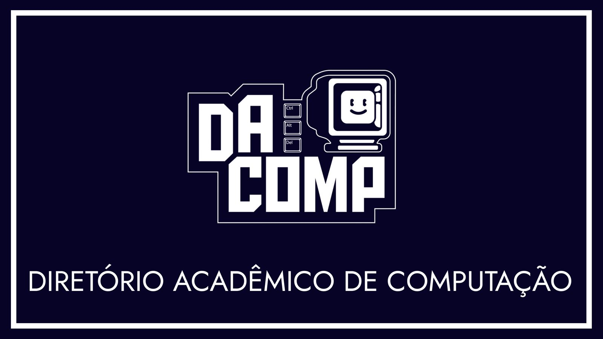

# DACOMP UFMA 🚀

Bem-vindo ao **Diretório Acadêmico de Ciência da Computação da UFMA**! Somos uma comunidade apaixonada por tecnologia, inovação e aprendizado colaborativo. Nossa missão é **empoderar estudantes e entusiastas** com materiais de qualidade, cursos práticos e projetos que transformam ideias em realidade. 🌟

## 🖥️ O que é a DACOMP UFMA?

O DACOMP UFMA é o coração da comunidade de Ciência da Computação da Universidade Federal do Maranhão. Aqui, você encontrará:

- 📚 **Materiais de Cursos**: Repositórios repletos de recursos sobre Pygame, Linguagem C, Versionamento de Software, e muito mais!
- 🤝 **Engajamento da Comunidade**: Eventos, workshops e hackathons para conectar estudantes e profissionais.
- 💡 **Projetos Colaborativos**: Espaço para desenvolver soluções inovadoras com outros membros da comunidade.
- 🌐 **Acessibilidade**: Conteúdo aberto e gratuito para todos os níveis, do iniciante ao avançado.

---

## 🔥 Por que se juntar a nós?

| **Aprenda** | **Contribua** | **Conecte-se** |
| --- | --- | --- |
| Domine tecnologias com nossos materiais organizados e práticos. 📖 | Faça parte de projetos reais e adicione ao seu portfólio. 🛠️ | Conheça pessoas incríveis e expanda sua rede na área tech. 🤗 |

---

## 📂 Nossos Repositórios

Explore nossos repositórios e encontre o que você precisa para turbinar seus estudos ou projetos:

- **Curso de Python Básico**: Ideal para iniciantes na programação! 🐍
- **Desenvolvimento Web**: Aprenda HTML, CSS, JavaScript e frameworks modernos. 🌐
- **Machine Learning**: Mergulhe no mundo da inteligência artificial. 🤖
- **Hackathons**: Soluções criativas desenvolvidas em eventos da comunidade. ⚡

👉 **Confira todos os repositórios na nossa organização no GitHub!**

---

## 🤖 Como Contribuir?

Quer fazer parte dessa jornada? É super fácil:

1. **Fork** um dos nossos repositórios.
2. **Crie** ou melhore materiais, adicione exemplos ou corrija erros.
3. **Envie um Pull Request** e junte-se à comunidade! 🚀
4. Leia nosso Guia de Contribuição para mais detalhes.

---

## 🌍 Conecte-se com a Comunidade

Fique por dentro das novidades e participe das nossas iniciativas:

- 📣 **Siga-nos no Instagram**: @dacomp_ufma
- 📧 **Contato**: dacomp@ufma.br
- 🗣️ **Eventos**: Fique de olho nos nossos workshops e hackathons!

---

## 🏆 Nossos Valores

- **Inclusão**: Todos são bem-vindos, independentemente do nível de experiência.
- **Colaboração**: Juntos, construímos conhecimento e soluções incríveis.
- **Inovação**: Sempre buscando novas formas de aprender e criar.

---

## 🌟 Apoiadores e Parceiros

Agradecemos à UFMA e à nossa comunidade por tornarem o DACOMP possível! 🙌

---

**DACOMP UFMA** - Transformando o futuro da tecnologia, uma linha de código por vez. 💻
